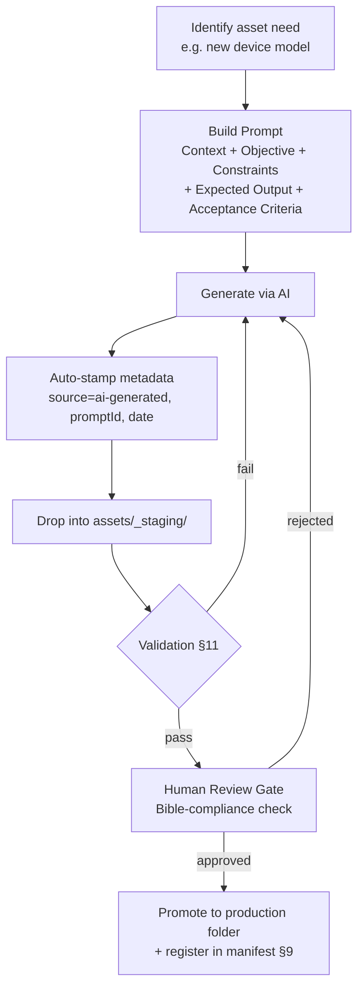
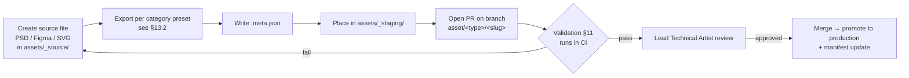
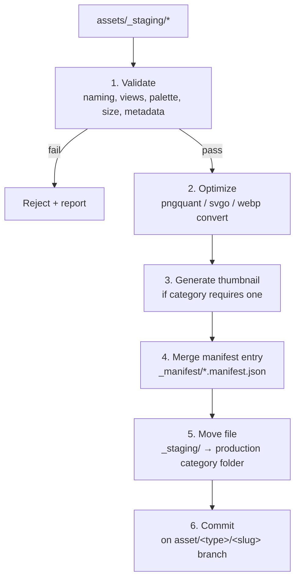

# 🏭 ASSET PRODUCTION PIPELINE
# Used Phone Shop Tycoon

Version: 1.0

Status: Proposed — Pending Project Owner Approval

Author Role: Lead Technical Artist / Pipeline Engineer / Production Architect (AI-assisted, per `PROMPT BIBLE`)

---

# 0. Purpose & Scope

This document defines the **production pipeline** for every visual and audio asset in the game.

It does **not** redesign gameplay, does **not** modify the prototype, and does **not** add game features. Per `GAME_CONSTITUTION.md` Section 9 (AI Development Policy), this document is a proposal — final adoption is the project owner's decision.

It exists to answer one question at scale:

> When this game has 1000+ NPCs, hundreds of phones, hundreds of furniture items, multiple environments, and a large UI library — how does any single asset stay findable, nameable, valid, and safe to reference from code, without the project collapsing into chaos?

## 0.1 Source Documents Reviewed

This pipeline is derived from, and must stay consistent with, every existing Bible and architecture document:

| Document | What this pipeline inherits from it |
|---|---|
| `GAME_CONSTITUTION.md` | Data-driven, modular, AI-assisted, performance-first principles |
| `SYSTEM_ARCHITECTURE.md` | Existing `assets/` layer sketch, module boundaries, data layer (`*.json`) |
| `MODULE_SPECIFICATION.md` | Standard spec template — mirrored here as the **Asset Type Spec** pattern |
| `docs/Bibles/01_UI BIBLE.md` | Card style, button states, receipt UI, dashboard, mobile-first layout |
| `docs/Bibles/02_COLOR BIBLE.md` | Palette, one-color-one-meaning rule, condition/reputation color scales |
| `docs/Bibles/03_TYPOGRAPHY_BIBLE.md` | Font families, money/number formatting rules |
| `docs/Bibles/04_CHARACTER_BIBLE.md` | Layered character system, view angles, expression sheet, categories |
| `docs/Bibles/05_DEVICE_BIBLE.md` | Fake brands, required views, condition levels, device passport |
| `docs/Bibles/06_FURNITURE_BIBLE.md` | Categories, levels 1–5, grid system, furniture blueprint fields |
| `docs/Bibles/07_ENVIRONMENT_BIBLE.md` | Shop interior/exterior categories, shop progression levels, environment blueprint fields |
| `docs/Bibles/08_ANIMATION_BIBLE.md` | Timing budgets, easing rules, animation categories |
| `docs/Bibles/09_AUDIO_BIBLE.md` | Audio categories, volume buses, priority tiers |
| `docs/Bibles/10_PROMPT_BIBLE.md` | AI prompt structure — reused directly as the AI Generation Workflow |
| `ROADMAP.md` | Milestone 03 (Design Bible) is done; this pipeline is Milestone 04/05 infrastructure |

## 0.2 Current State (Ground Truth)

As of this writing, the repository has **no `assets/` folder, no `data/` folder, and no build tooling**. Only documentation and one prototype file exist. This pipeline is therefore a **greenfield design** — nothing described below overwrites existing content; it defines where content will go once production starts.

## 0.3 Non-Goals

- Does not change `GAME_CONSTITUTION.md`, any Bible, `ROADMAP.md`, or `SYSTEM_ARCHITECTURE.md`.
- Does not touch `Prototype/Prototype_v.01/prototype.html`.
- Does not introduce new gameplay systems (Employees, Pawn, Auctions, etc.) — it only prepares the pipeline that will eventually feed art into those systems when they are designed.
- Does not generate or commit any actual artwork.

---

# 1. Asset Folder Structure

Assets live at repo root in `assets/`, mirroring the layer already named in `SYSTEM_ARCHITECTURE.md`, expanded to production depth.

```
assets/
├── _source/                 # Raw editable files (PSD, AI, Figma, SVG source). NOT loaded by the game.
│   ├── characters/
│   ├── devices/
│   ├── furniture/
│   ├── environments/
│   ├── ui/
│   └── audio/
│
├── _staging/                 # New/incoming assets awaiting validation. See §14 Import Workflow.
│
├── characters/
│   ├── layers/                # Shared, reusable layer library (Character Bible §Layers)
│   │   ├── hair/
│   │   ├── eyes/
│   │   ├── eyebrows/
│   │   ├── mouth/
│   │   ├── clothes/
│   │   └── accessories/
│   ├── unique/                 # Fully bespoke art: story characters, VIPs, owner avatar
│   ├── expressions/             # Shared expression sheets (7 required moods)
│   └── thumbnails/
│
├── devices/
│   ├── models/
│   │   └── <brand>/<model>/     # Base renders per required view (Device Bible §Required Views)
│   ├── overlays/
│   │   ├── damage/               # Screen crack, back-glass crack, scratches, dust, dents
│   │   └── screen-states/        # On, off, broken, scratched, black, charging
│   └── thumbnails/
│
├── furniture/
│   ├── <category>/<item>/<level>/
│   └── thumbnails/
│
├── environments/
│   ├── shop-interior/<area>/<level>/
│   ├── exterior/
│   ├── backgrounds/
│   └── lighting/<time-of-day>/
│
├── ui/
│   ├── icons/
│   ├── buttons/
│   ├── cards/
│   ├── receipt/
│   └── dashboard/
│
├── animation/
│   └── clips/                    # JSON animation clip definitions (see §8)
│
├── audio/
│   ├── sfx/
│   ├── music/
│   └── ambient/
│
└── _manifest/                    # Generated, not hand-edited. See §9.
    ├── characters.manifest.json
    ├── devices.manifest.json
    ├── furniture.manifest.json
    ├── environments.manifest.json
    ├── ui.manifest.json
    ├── animation.manifest.json
    ├── audio.manifest.json
    └── asset-index.json          # Master index of every manifest
```

**Rules:**
- `_source/` and `_staging/` are never referenced by game code — only `_manifest/`-registered production paths are.
- Every top-level category folder mirrors one Bible document 1:1. If a new Bible is added, a new top-level folder is added — never nested inside an unrelated category.
- No asset file lives outside its category folder. No "misc" or "other" folder is permitted (Golden Rule from `MODULE_SPECIFICATION.md`: avoid god-folders the same way we avoid god-modules).

---

# 2. Naming Convention

## 2.1 General Pattern

```
{type}_{descriptor}_{variant}[_{view}][_{state}]_v{NNN}.{ext}
```

| Field | Rule |
|---|---|
| `type` | Fixed short prefix per asset category (table below) |
| `descriptor` | kebab-case subject identifier (brand, model, item, action) |
| `variant` | Optional — color, level, personality, condition tag |
| `view` | Optional — `front`, `back`, `left`, `right`, `45deg`, `thumb` |
| `state` | Optional — `on`, `off`, `broken`, `pressed`, `disabled` |
| `v{NNN}` | Always present. Zero-padded, 3 digits. `v001`, `v002`... |
| Case | All lowercase. Words inside a field separated by `-`. Fields separated by `_`. |

## 2.2 Type Prefixes

| Prefix | Category |
|---|---|
| `chr` | Character (layer or unique) |
| `dev` | Device |
| `fur` | Furniture |
| `env` | Environment |
| `ui` | UI element |
| `icon` | Icon (subset of UI, used constantly, kept short) |
| `anim` | Animation clip |
| `sfx` / `music` / `amb` | Audio (Bible-aligned sub-categories) |
| `fx` | Visual effect (Animation Bible "Allowed" effects only) |

## 2.3 Examples

```
chr_layer_hair-short-black_v001.png
chr_layer_cloth_casual-tshirt-blue_v001.png
chr_unique_pa-daeng-owner_front_v001.png
chr_expr_happy_v001.png

dev_ipear_x12_black_front_v001.png
dev_sansung_g21_silver_45deg_v001.png
dev_overlay_crack-screen-heavy_v001.png
dev_overlay_screen-off_v001.png

fur_display_shelf_lvl1_v001.png
fur_decor_plant_lvl3_v001.png

env_shop_main_lvl1_morning_v001.png
env_exterior_storefront_lvl2_v001.png

ui_btn-primary_default_v001.svg
ui_btn-primary_pressed_v001.svg
icon_cash_v001.svg

anim_chr_idle-blink_v001.json
anim_ui_card-fadein_v001.json

sfx_business_cash-register_v001.mp3
music_shop-theme_v001.mp3
amb_environment_street-traffic_v001.mp3
```

## 2.4 Validation Regex (reference implementation)

```regex
^(chr|dev|fur|env|ui|icon|anim|sfx|music|amb|fx)_[a-z0-9-]+(_[a-z0-9-]+)*_v[0-9]{3}\.(png|svg|json|mp3|webp)$
```

Any file that does not match its category's regex fails validation (§11) and cannot enter `_manifest/`.

---

# 3. Character Asset Structure

The Character Bible mandates layered generation for "thousands of unique combinations." This is the pipeline's answer to **1000+ NPCs**: NPCs are not 1000 hand-authored illustrations — they are **data recipes** composed from a small shared layer library at render time.

## 3.1 Layer Library (authored once, reused everywhere)

```
assets/characters/layers/
├── hair/        chr_layer_hair-<style>-<color>_v001.png   (7 styles × ~6 colors ≈ 40 assets)
├── eyes/        chr_layer_eyes-<shape>-<color>_v001.png
├── eyebrows/    chr_layer_eyebrows-<shape>_v001.png
├── mouth/       chr_layer_mouth-<expression>_v001.png     (maps to 7 required expressions)
├── clothes/     chr_layer_cloth-<style>-<color>_v001.png  (casual, business-casual, uniform...)
└── accessories/ chr_layer_acc-<item>_v001.png              (glasses, hat, watch, backpack...)
```

Each layer file: transparent PNG, fixed canvas size, fixed anchor point, front view only (matches Character Bible's required "Front" view; 3/4, Left, Right generated by the renderer via horizontal flip + perspective shader where the Bible allows, or authored separately only for `unique/` characters where flip is visually wrong, e.g. asymmetric hair or accessories).

## 3.2 Character Recipe (the actual "NPC")

An NPC is a JSON object referencing layer IDs, not a flattened image:

```json
{
  "id": "chr_0001",
  "type": "recipe",
  "category": "seller",
  "ageGroup": "young-adult",
  "occupation": "student",
  "personality": "friendly",
  "layers": {
    "hair": "chr_layer_hair-short-black_v001",
    "eyes": "chr_layer_eyes-round-brown_v001",
    "eyebrows": "chr_layer_eyebrows-straight_v001",
    "mouth": "chr_layer_mouth-neutral_v001",
    "clothes": "chr_layer_cloth-casual-tshirt-blue_v001",
    "accessories": ["chr_layer_acc-backpack_v001"]
  },
  "skinTone": "#C68863",
  "expressionSet": ["happy", "neutral", "thinking", "disappointed", "angry"],
  "bibleVersion": "CHARACTER_BIBLE v1.0"
}
```

Thousands of unique NPCs = combinatorics of a ~50–80 asset layer library. Only `unique/` story/VIP characters (small, bounded count) get bespoke fully-painted art files.

## 3.3 Required Views (per Character Bible)

Front (required, authored) → 3/4 Front, Left, Right (generated or authored for `unique/` only) → Back, Portrait, Expression Sheet (optional, `unique/` only).

## 3.4 Expression Requirement

Every character (recipe or unique) must resolve all 7 Bible-required expressions: 😊 Happy, 😐 Neutral, 🤔 Thinking, 😮 Surprised, 😡 Angry, 😭 Disappointed, 😁 Excited — via the shared `mouth` + `eyebrows` layer swap for recipes, or a full expression sheet for `unique/`.

---

# 4. Device Asset Structure

Same combinatorial problem as characters, solved the same way: **base render + condition/damage overlays**, not one baked image per phone × condition × damage combination.

```
assets/devices/
├── models/
│   └── ipear/x12/
│       ├── dev_ipear_x12_black_front_v001.png
│       ├── dev_ipear_x12_black_back_v001.png
│       ├── dev_ipear_x12_black_left_v001.png
│       ├── dev_ipear_x12_black_right_v001.png
│       ├── dev_ipear_x12_black_45deg_v001.png
│       └── dev_ipear_x12_black_thumb_v001.png
├── overlays/
│   ├── damage/
│   │   ├── dev_overlay_crack-screen-light_v001.png
│   │   ├── dev_overlay_crack-screen-heavy_v001.png
│   │   ├── dev_overlay_crack-back-glass_v001.png
│   │   ├── dev_overlay_scratch-light_v001.png
│   │   └── dev_overlay_dust_v001.png
│   └── screen-states/
│       ├── dev_overlay_screen-on_v001.png
│       ├── dev_overlay_screen-off_v001.png
│       └── dev_overlay_screen-broken_v001.png
```

**Compositing rule** (per Device Bible's 0–100% condition scale): condition value maps to an overlay tier, resolved at render time —

| Condition | Overlay tier applied |
|---|---|
| 90–100% | none |
| 70–89% | `scratch-light` |
| 50–69% | `scratch-light` + `dust` |
| 30–49% | `crack-screen-light` |
| 0–29% | `crack-screen-heavy` + `crack-back-glass` |

New phone models only require the base 6 views per color variant — the damage/condition system is shared across all models forever. This is what keeps "hundreds of phones" tractable.

## 4.1 Device Passport (metadata, not art)

Per Device Bible's "Device Passport" concept, every **instance** in inventory (not the model) carries its own metadata record — this lives in save/inventory data, not in `assets/`, and references the model's asset ID:

```json
{
  "instanceId": "inv_00042",
  "modelAssetId": "dev_ipear_x12_black",
  "condition": 62,
  "conditionOverlay": "scratch-light+dust",
  "purchasePrice": 4200,
  "repairHistory": []
}
```

---

# 5. Furniture Asset Structure

Mirrors the Furniture Bible's Category × Level matrix directly.

```
assets/furniture/
├── business/
│   └── display-shelf/
│       ├── fur_display-shelf_lvl1_v001.png
│       ├── fur_display-shelf_lvl2_v001.png
│       ├── fur_display-shelf_lvl3_v001.png
│       ├── fur_display-shelf_lvl4_v001.png
│       └── fur_display-shelf_lvl5_v001.png
├── decoration/
├── customer-area/
├── employee-area/
└── utility/
```

## 5.1 Furniture Blueprint (metadata schema)

Directly implements the field list from `06_FURNITURE_BIBLE.md`'s "Furniture Blueprint" section:

```json
{
  "furnitureId": "fur_display-shelf",
  "category": "business",
  "level": 1,
  "size": { "w": 2, "h": 2 },
  "price": 1500,
  "sellValue": 750,
  "function": "inventory-capacity",
  "bonus": { "inventorySlots": 5 },
  "placementArea": "shop-floor",
  "interaction": ["move", "rotate", "upgrade", "sell", "inspect"],
  "upgradePath": ["fur_display-shelf_lvl2", "fur_display-shelf_lvl3"],
  "assetName": "fur_display-shelf_lvl1_v001.png",
  "rotation": [0, 90, 180, 270]
}
```

Grid `size` and `rotation` fields directly encode the Bible's Grid System (1×1 / 2×2 / 3×3, 0°/90°/180°/270°) so placement logic never guesses footprint from pixel dimensions.

---

# 6. Environment Asset Structure

```
assets/environments/
├── shop-interior/
│   ├── main-store/lvl1..lvl5/
│   ├── repair-area/lvl1..lvl5/
│   ├── cashier-area/lvl1..lvl5/
│   ├── display-area/lvl1..lvl5/
│   └── waiting-area/lvl1..lvl5/
├── exterior/
│   └── storefront/lvl1..lvl5/
├── backgrounds/
│   └── city-small-town/
└── lighting/
    ├── morning/
    ├── afternoon/
    ├── evening/
    └── night/
```

Lighting is a **separate overlay layer** (per Environment Bible's "Lighting" + "Time of Day" sections), composited over a base environment render — never baked per time-of-day per level, for the same combinatorial reason as devices.

## 6.1 Environment Blueprint (metadata schema)

Directly implements `07_ENVIRONMENT_BIBLE.md`'s "Environment Blueprint" field list:

```json
{
  "environmentId": "env_shop-main_lvl1",
  "theme": "small-local-shop",
  "size": { "w": 8, "h": 6 },
  "lighting": "warm-white",
  "furnitureSlots": 12,
  "customerCapacity": 3,
  "expansionSlots": 2,
  "background": "city-small-town",
  "ambientSound": "amb_environment_shop-ambience_v001",
  "decorationPoints": 4
}
```

---

# 7. UI Asset Structure

Maps directly to `01_UI BIBLE.md` sections, using atomic hierarchy so 1000s of screens later still reuse the same ~30 primitives:

```
assets/ui/
├── icons/          icon_<name>_v001.svg          (flat, single-color, consistent 24px grid)
├── buttons/         ui_btn-<variant>_<state>_v001.svg
│                     variants: primary | secondary | danger | warning | disabled
│                     states:   default | pressed | hover | disabled
├── cards/           ui_card-<context>_v001.svg    (customer, inventory, receipt, summary, dashboard)
├── receipt/          ui_receipt-<element>_v001.svg  (signature UI element — see UI Bible §Receipt Style)
└── dashboard/        ui_dash-<element>_v001.svg
```

**Rule:** icon/button colors are never hand-picked per asset — every fill references a token from the Color Bible (`--gold`, `--coral`, etc., §2.1). A validation rule (§11) checks exported SVG fill values against the approved palette hex list.

---

# 8. Animation Asset Structure

The tech stack is HTML5/CSS3/JS (no game engine), so "animation assets" are **JSON clip definitions**, not baked video/spritesheets, except where a spritesheet is explicitly cheaper (idle/blink loops).

```
assets/animation/clips/
├── anim_chr_idle-blink_v001.json
├── anim_chr_talk_v001.json
├── anim_ui_card-fadein_v001.json
├── anim_ui_btn-press_v001.json
├── anim_money_earned-float_v001.json
└── anim_repair_progress_v001.json
```

Clip schema — timing/easing values are **pulled directly from `08_ANIMATION_BIBLE.md`'s Timing table**, never hand-guessed per clip:

```json
{
  "id": "anim_ui_card-fadein",
  "target": "ui.card",
  "durationMs": 180,
  "easing": "ease-out",
  "keyframes": [
    { "t": 0, "opacity": 0, "translateY": 8 },
    { "t": 1, "opacity": 1, "translateY": 0 }
  ],
  "soundCue": "sfx_ui_open-window_v001"
}
```

**Validation rule:** `durationMs` must fall inside the Bible's category range (Instant Feedback 50–100ms, Small UI Motion 100–150ms, Card 150–200ms, Popup 200–250ms, Dialog 250–300ms, Screen Transition ≤300ms). Anything above 400ms is auto-rejected per the Bible's hard rule.

---

# 9. Manifest System

Manifests are the **single source of truth** connecting a file on disk to a game-usable ID. Game code never does folder scans or string-guesses paths — it only reads `_manifest/*.json`.

## 9.1 Structure

One manifest per asset category, plus a master index:

```json
// assets/_manifest/devices.manifest.json
{
  "schemaVersion": 1,
  "generatedAt": "2026-08-07T00:00:00Z",
  "assets": [
    {
      "id": "dev_ipear_x12_black",
      "views": {
        "front": "devices/models/ipear/x12/dev_ipear_x12_black_front_v001.png",
        "back":  "devices/models/ipear/x12/dev_ipear_x12_black_back_v001.png",
        "left":  "devices/models/ipear/x12/dev_ipear_x12_black_left_v001.png",
        "right": "devices/models/ipear/x12/dev_ipear_x12_black_right_v001.png",
        "45deg": "devices/models/ipear/x12/dev_ipear_x12_black_45deg_v001.png",
        "thumb": "devices/models/ipear/x12/dev_ipear_x12_black_thumb_v001.png"
      },
      "status": "active",
      "bibleVersion": "DEVICE_BIBLE v1.0"
    }
  ]
}
```

```json
// assets/_manifest/asset-index.json
{
  "schemaVersion": 1,
  "categories": {
    "characters": "characters.manifest.json",
    "devices": "devices.manifest.json",
    "furniture": "furniture.manifest.json",
    "environments": "environments.manifest.json",
    "ui": "ui.manifest.json",
    "animation": "animation.manifest.json",
    "audio": "audio.manifest.json"
  },
  "totalAssetCount": 0
}
```

## 9.2 Rules

- Manifests are **generated by a script** (§14), never hand-edited. Hand edits are overwritten on next import run.
- Every manifest entry's `id` is permanent once shipped — required for save-file compatibility (`10_SAVE SYSTEM.md`: "never break existing saves").
- Removing a file from disk without updating the manifest is a validation failure (§11), not a silent break.

---

# 10. Metadata Structure

Every individual asset file gets a co-located `.meta.json` (source-of-truth for the manifest generator), independent of the manifest itself — this is what survives even if the manifest is regenerated from scratch.

```json
// dev_ipear_x12_black_front_v001.png.meta.json
{
  "id": "dev_ipear_x12_black",
  "category": "devices",
  "tags": ["flagship", "ipear", "black"],
  "dimensions": { "w": 1024, "h": 1024 },
  "format": "png",
  "transparentBackground": true,
  "source": "ai-generated",
  "sourcePromptId": "prompt_dev_0042",
  "bibleVersion": "DEVICE_BIBLE v1.0",
  "colorPaletteChecked": true,
  "createdBy": "pipeline-ai",
  "createdAt": "2026-08-07",
  "checksum": "sha256:…",
  "license": "project-owned"
}
```

| Field | Purpose |
|---|---|
| `source` | `artist` \| `ai-generated` \| `hybrid` — required for §12/§13 accountability |
| `sourcePromptId` | Traceability back to the exact AI prompt used (Prompt Bible §Prompt Versioning) |
| `bibleVersion` | Which Bible version this asset was validated against — flags it for re-review if the Bible is later bumped to v2.0 |
| `checksum` | Detects silent file corruption/tampering; also powers duplicate detection |
| `license` | Guards against accidental use of non-project-owned reference material |

---

# 11. Asset Validation Rules

Automated, run in CI (or a local pre-commit script) before any asset reaches `_manifest/`. This is the pipeline's quality gate — no asset skips it, regardless of whether it came from an artist or an AI.

| # | Rule | Failure condition |
|---|---|---|
| 1 | Naming convention | Filename doesn't match category regex (§2.4) |
| 2 | Required views present | e.g. a device missing one of front/back/left/right/45deg/thumb |
| 3 | Transparent background | Character/device/furniture/UI PNG has non-transparent canvas edges where required |
| 4 | Dimension conformance | Asset doesn't match the fixed canvas size for its category |
| 5 | Color palette conformance | Any fill/stroke hex not present in `02_COLOR BIBLE.md`'s palette table |
| 6 | File size budget | Exceeds per-category size ceiling (see §16 performance budget) |
| 7 | Duplicate ID | Two files resolve to the same manifest `id` |
| 8 | Orphan detection (file→manifest) | File exists on disk, not registered in any manifest |
| 9 | Orphan detection (manifest→file) | Manifest entry points at a path that doesn't exist |
| 10 | Metadata presence | `.meta.json` missing or missing required fields |
| 11 | Animation timing budget | `durationMs` outside the Animation Bible's allowed range for its category |
| 12 | Version monotonicity | New file re-uses a `v{NNN}` already claimed by an existing manifest entry for the same id |
| 13 | Bible version stamp | `.meta.json.bibleVersion` missing or references an unknown Bible version |

Reference validator invocation (pseudo-CLI, no tooling is being installed by this document — this defines the contract for whoever implements it in Milestone 05):

```bash
node scripts/pipeline/validate-assets.js --path assets/_staging --strict
```

Exit code `0` = promote-eligible. Non-zero = blocked, human-readable report printed per rule violated.

---

# 12. AI Generation Workflow

Built directly on `10_PROMPT_BIBLE.md`'s five-part prompt structure — this section is that structure applied specifically to asset generation.



## 12.1 Prompt Template (per Prompt Bible structure)

```markdown
### Context
Project: Used Phone Shop Tycoon. Module: Device Asset. Reference: DEVICE_BIBLE v1.0, COLOR_BIBLE v1.0.

### Objective
Generate the "front" view of a new flagship device: fictional brand "Kiaoni", model "K9", color black.

### Constraints
- Follow DEVICE_BIBLE.md: 2D illustration, modern flat, semi-realistic, clean outline, soft shadow.
- Transparent background, 1024×1024, consistent lighting/perspective with existing dev_* assets.
- No photorealism. No real-world brand likeness.

### Expected Output
Single PNG, filename: dev_kiaoni_k9_black_front_v001.png

### Acceptance Criteria
- Passes Validation Rules §11 (naming, transparency, dimensions, palette).
- Visually consistent with existing dev_ipear_* / dev_sansung_* front renders.
```

## 12.2 Rules

- Every AI-generated asset must record `sourcePromptId` in its `.meta.json` — untraceable AI output is rejected at intake, no exceptions.
- AI never writes directly into a production folder. It only writes to `_staging/`.
- AI-generated assets must clear the **same** validation gate as artist-made ones — no separate, looser standard (Prompt Bible: "AI is a development partner," not a shortcut around quality).

---

# 13. Artist Workflow



## 13.1 Branching

Extends `docs/CONTRIBUTING.md`'s existing branch convention (`feature/…`, `fix/…`, `docs/…`, `prototype/…`) with one addition:

```
asset/<category>/<slug>
```

Examples: `asset/devices/kiaoni-k9`, `asset/characters/hair-library-batch2`, `asset/furniture/display-shelf-lvl2`.

## 13.2 Source & Export Presets

| Category | Source format | Export format | Fixed canvas |
|---|---|---|---|
| Character layers | PSD, one folder-group per Character Bible layer | PNG, transparent | 512×512 |
| Devices | PSD/AI, one artboard per view | PNG, transparent | 1024×1024 |
| Furniture | PSD/AI | PNG, transparent | 1024×1024 |
| Environments | PSD/AI, layered by lighting pass | PNG or WebP | 1920×1080 |
| UI | Figma/SVG | SVG (icons/buttons), PNG fallback | 24px grid (icons), 9-slice safe (buttons) |
| Animation | N/A (data-authored) | JSON clip | — |

## 13.3 PR Checklist (extends CONTRIBUTING.md)

- [ ] Passes `validate-assets.js --strict`
- [ ] `.meta.json` present and complete
- [ ] Matches the relevant Bible (state which Bible + version in PR description)
- [ ] No unrelated asset categories touched in the same PR (one-module-one-responsibility, applied to assets)

---

# 14. Import Workflow

The automated pipeline that turns a `_staging/` file into a production-ready, manifest-registered asset. Identical entry point for both AI (§12) and artist (§13) sources.



Reference script contract (to be implemented in Milestone 05, not shipped by this document):

```bash
node scripts/pipeline/import-assets.js --staging assets/_staging --dry-run   # preview only
node scripts/pipeline/import-assets.js --staging assets/_staging --commit    # execute
```

`--dry-run` is mandatory in CI on every PR; `--commit` only runs after human approval (§12/§13 review gates).

---

# 15. Versioning Strategy

## 15.1 Per-Asset Versioning

- Every asset filename carries `_v{NNN}`. A changed asset is a **new file** (`v002`), never an overwrite of `v001`.
- The manifest's `id` stays stable across versions; only the resolved file path bumps. Old versions are kept on disk (or archived, §15.3), never deleted outright.

## 15.2 Why (Save Compatibility)

`10_SAVE SYSTEM.md` requires old saves to remain loadable. A save file may reference `dev_ipear_x12_black` from months ago; if that asset's art changes, the **id must still resolve** to *something* valid. Bumping the version while keeping the id stable satisfies this without any special-case save-migration code for art alone.

## 15.3 Deprecation, Not Deletion

```json
{
  "id": "chr_layer_hair-short-black",
  "status": "deprecated",
  "deprecatedInFavorOf": "chr_layer_hair-short-black_v002",
  "reason": "Bible v1.1 outline-thickness update"
}
```

`status: "deprecated"` assets stay in the manifest (so old references don't 404) but are excluded from new-content pickers/generators.

## 15.4 Bible Versioning Hook

Every `.meta.json` stamps the Bible version it was validated against (§10). When a Bible bumps to v1.1+, a validation report can be run to flag every asset stamped with the old version for re-review — this is how "1000+ assets" stays auditable against evolving design docs instead of drifting silently.

---

# 16. Future Scalability

| Concern | Strategy |
|---|---|
| **1000+ NPCs** | Layer-composition recipes (§3), not 1:1 authored art. Layer library grows sub-linearly with NPC count. |
| **Hundreds of phones** | Base model views + shared condition/damage overlay system (§4). New model ≈ 6 files, not 6 × 11 condition states. |
| **Hundreds of furniture items** | Shared category/level matrix; only *new* items need new art, level variants follow one upgrade-path template (§5). |
| **Multiple environments** | Base scene + separate lighting-pass overlays (§6), not one bake per time-of-day per level. |
| **Large UI library** | Atomic components (§7) — buttons/icons/cards reused across every future screen, styled only via Color Bible tokens. |
| **Web/mobile performance** | Production bundle step: sprite-atlas small/frequent assets (UI icons, character layers), WebP over PNG where alpha-safe, lazy-load environment/device assets per shop level so day-1 payload stays small (`UI BIBLE`: mobile-first, 60 FPS target). |
| **Repo size growth** | `_source/` (large PSDs) tracked via Git LFS (see Risks §18) so the working repo clone stays light. |
| **Localization (future TH/EN text assets)** | UI text is never baked into image assets (Typography Bible already separates fonts from art) — only truly graphical text (logos, marquee) gets a `_th` / `_en` variant suffix reserved in the naming convention for future use. |
| **New asset categories** | Adding a category = new Bible + new top-level `assets/<category>/` + new `_manifest/<category>.manifest.json`. The pattern established in §1–§10 is the template; nothing else in the pipeline needs to change. |

---

# 17. Recommended Repository Structure

Full target tree, reconciling `README.md`'s originally-stated structure, `SYSTEM_ARCHITECTURE.md`'s asset layer, and this pipeline — for Milestone 05 planning only, **not created by this document**:

```
used-phone-shop-tycoon/
├── README.md
├── ROADMAP.md
├── GAME_CONSTITUTION.md
│
├── docs/
│   ├── Bibles/
│   ├── Games design document/
│   ├── pipeline/
│   │   ├── ASSET_PRODUCTION_PIPELINE.md   ← this document
│   │   └── CHANGELOG_ASSETS.md             (future, §15)
│   ├── SYSTEM_ARCHITECTURE.md
│   ├── MODULE_SPECIFICATION.md
│   └── CONTRIBUTING.md
│
├── Prototype/
│   └── Prototype_v.01/
│
├── assets/                                  (per §1 — not yet created)
│   ├── _source/
│   ├── _staging/
│   ├── characters/
│   ├── devices/
│   ├── furniture/
│   ├── environments/
│   ├── ui/
│   ├── animation/
│   ├── audio/
│   └── _manifest/
│
├── data/                                    (per SYSTEM_ARCHITECTURE.md — not yet created)
│   ├── phones.json
│   ├── customers.json
│   ├── furniture.json
│   ├── economy.json
│   └── events.json
│
├── scripts/
│   └── pipeline/
│       ├── validate-assets.js               (§11 — not yet implemented)
│       └── import-assets.js                 (§14 — not yet implemented)
│
├── js/                                       (per MODULE_SPECIFICATION.md folder convention)
│   ├── customer/
│   ├── negotiation/
│   ├── inventory/
│   ├── repair/
│   ├── economy/
│   ├── sales/
│   ├── reputation/
│   ├── save/
│   └── ui/
│
└── css/
```

---

# 18. Risks and Potential Problems

| # | Risk | Impact | Mitigation |
|---|---|---|---|
| 1 | Binary asset bloat in a plain git repo | Slow clones, huge `.git`, painful history | Adopt **Git LFS** for `assets/_source/` and any raster asset over a size threshold before the first real batch lands |
| 2 | Manifest drift (disk vs. manifest disagree) | Runtime 404s, broken inventory items referencing missing art | Validation rules 8–9 (§11) run on every CI push, not just at import time |
| 3 | AI style inconsistency at scale (1000+ NPCs) | Breaks Character/Device Bible's "consistent universe" requirement | Locked prompt templates (§12.1) + mandatory human review gate before any batch promotes |
| 4 | Condition/damage overlay system looks fake or repetitive across hundreds of phones | Player-facing visual quality issue | Keep overlay count per tier small but let base renders (not overlays) carry most model-to-model visual variety |
| 5 | No CI currently exists in this repo (confirmed during repo audit) | Validation rules in §11 are unenforced until tooling exists | Flag `scripts/pipeline/*` + CI wiring as a hard Milestone 05 prerequisite before bulk asset import begins |
| 6 | Asset ID renamed/removed while old saves reference it | Save System's "never break existing saves" rule violated | Deprecate-don't-delete policy (§15.3) is mandatory, not optional |
| 7 | Merge conflicts on binary files (two artists edit the same PSD) | Lost work, corrupted files | One-asset-per-branch convention (§13.1) + PSDs are never edited by two people in parallel — enforced by folder/file ownership, not git merge |
| 8 | Thai + English text rendering / font glyph coverage gaps | Broken dialogue text in-game | Typography Bible's Noto Sans Thai requirement is a validation-adjacent concern — track as a font-asset QA item, not an image-asset one |
| 9 | Over-scoping the pipeline itself (building tooling nobody uses yet) | Wasted effort, violates Constitution's "Core Loop First" | This document defines contracts (schemas, naming, folder shape) now; actual script implementation is deliberately deferred to Milestone 05, gated by real asset volume arriving |
| 10 | Licensing/provenance ambiguity for AI-generated art | Legal/IP risk if source model's training data or terms are unclear | `.meta.json license` field (§10) mandatory on every AI asset; project owner sign-off required before any AI asset ships in a public build |
| 11 | Palette/typography drift as more contributors join | Slow visual inconsistency across hundreds of UI assets | Rule 5 (§11) mechanically checks hex values against `COLOR_BIBLE.md` — a human can't "eyeball approve" a slightly-off color into production |
| 12 | Pipeline docs go stale as Bibles evolve (v1.0 → v1.1+) | Old assets silently fall out of compliance | `bibleVersion` stamping (§10) + version hook (§15.4) make staleness auditable instead of invisible |

---

# Adoption Checklist (Next Steps)

This document alone does not implement anything. To activate it:

1. Project owner reviews and approves this document (flip **Status** to `Active`).
2. Create `assets/`, `data/`, `scripts/pipeline/` per §17 (empty scaffolding).
3. Implement `validate-assets.js` and `import-assets.js` per §11/§14 contracts.
4. Wire validation into CI so §11 is enforced automatically, not manually.
5. Author the Character layer library (§3.1) first — it unlocks NPC scale fastest and de-risks the AI generation workflow (§12) on a small, bounded asset set before devices/furniture/environments follow.

---

# Final Principle

An asset pipeline is not decoration on top of the game — it is the reason 1000+ NPCs and hundreds of phones stay maintainable instead of becoming 1000+ one-off files nobody can safely touch.

Every asset should be:

Traceable to a Bible.

↓

Named predictably.

↓

Validated automatically.

↓

Versioned safely.

↓

Replaceable without breaking a save.

If a new asset cannot answer "which Bible, which manifest, which validation rule" — it is not ready for production.
